# <center><font face="仿宋" font color=orange>CAN入门教程</font>
## <center><font face="楷体" size=5>风水master</font></center>
### 前言
本文为作者学习CAN总线时同步撰写的，希望能帮助不会使用CAN总线的人快速上手
本文覆盖了标准CAN总线从协议，硬件，软件，调试的全部过程
作者学习CAN总线主要看江协科技的视频，所以协议部分的图片全部来源于江协科技的PPT
与江协科技不同的是江协科技是在STMF103上实践的，作者是在STMG474上实践的

### 一、CAN总线特性
1. 差分通信，速度快，高速can：125k~1Mbps
2. 异步，半双工
3. 11位/29位ID，单次可传输1-8有效数据
4. 广播和请求两种方式
5. 高速can要在两端加120ohm电阻形成闭环网络(这使得电平变换速度变快但同时会增大功耗)
6. 实际使用中可以共地以防止收发器的电压过高
7. 收发器的Rx接CAN的Rx，Tx接Tx
8. 高速can总线最多链接30个单元
### 二、电平标准
1. $dV=Vcanh-Vcanl$
2. 高速can下$dV$为0V表示逻辑1，$dV$为2V表示逻辑0，
   IO口不驱动总线时终端电阻使H和L电平相同表示逻辑1，
   IO口驱动总线把H和L电平拉开时表示逻辑0，
   故默认电平为1，并且0强于1。
   
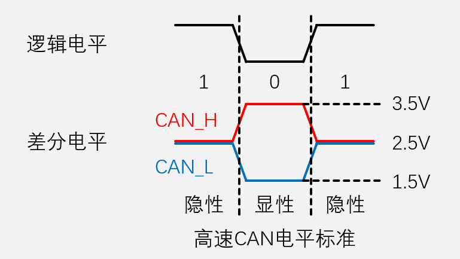 
### 三、帧格式
#### 1.数据帧:发送设备主动发送数据(广播式)
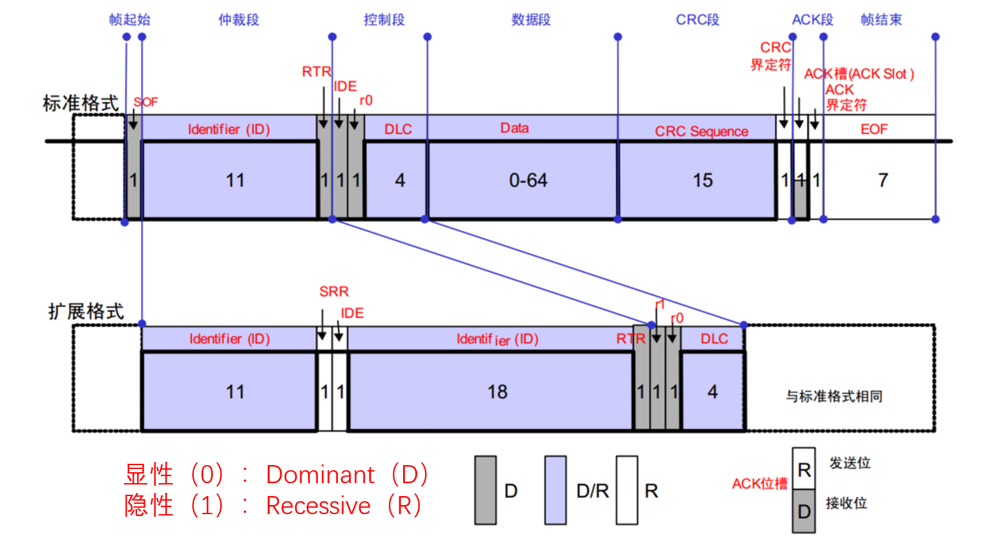 
1. SOF(帧起始)：1位逻辑0
2. ID(标识符)：标准格式为11位，拓展ID为29位
3. RTR(远程请求位)：逻辑0表示数据帧，逻辑1表示遥控帧，ID相同时数据帧的优先级大于遥控帧
4. IDE(ID扩展标志位)：逻辑0表示标准格式，逻辑1表示扩展格式
5. r0(保留位0)：保留
6. DLC(数据段长度)：4位可指定0-8个字节
7. CRC(循环冗余校验)：15位
8. CRC界定符：1位逻辑1，发送方释放总线变成逻辑1
9. ACK槽：应答位，接收方接收到数据会发送逻辑0，发送方读取应答位
10. ACK界定符：接收方释放总线变成逻辑1
11. EOF(帧结束)：7位逻辑1
12. SSR：1位逻辑1用于仲裁，表示标准格式优先级高于拓展格式，并代替了原来的RTR
13. r1(保留位1)：代替原来的IDE，保留位
#### 2.遥控帧：接收设备主动请求数据（请求式）
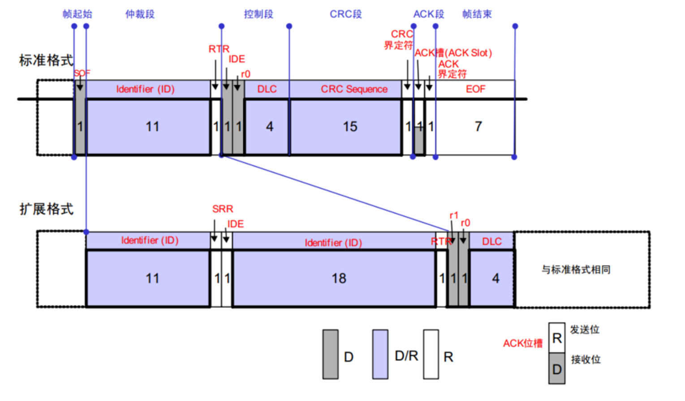
1. 遥控帧无数据段，RTR为隐性电平1，其他部分与数据帧相同
2. 遥控帧的ID就是目的设备ID，所以目的设备主动广播和接收设备请求数据同时发生时，数据帧的优先级更高
#### 3.错误帧：某个设备检测出错误时向其他设备通知错误
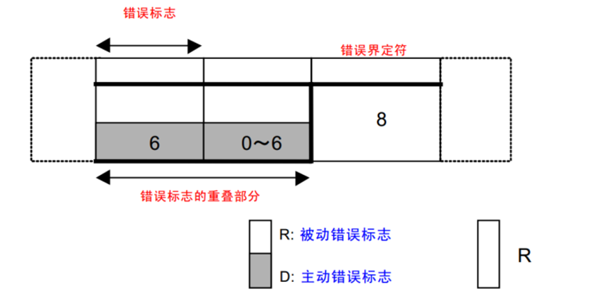
1. 设备默认在主动错误状态
2. 主动错误连续发送6个逻辑0，会破坏正在传输的数据
3. 主动错误发送太频繁会进入被动错误状态
4. 被动错误连续发送6个逻辑1，会破坏自己发送的数据
5. 6位的错误帧少于7位的EOF，所以接收设备肯定来得及接收错误帧
#### 4.过载帧：接收设备通知其尚未做好接收准备
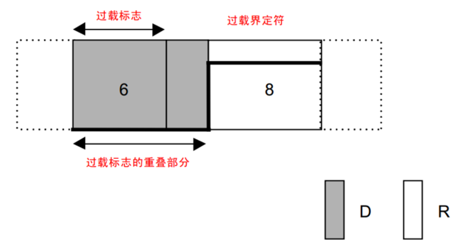
1. 接收方来不及处理数据时发送
#### 5.帧间隔：用于将数据帧及遥控帧与前面的帧分离开
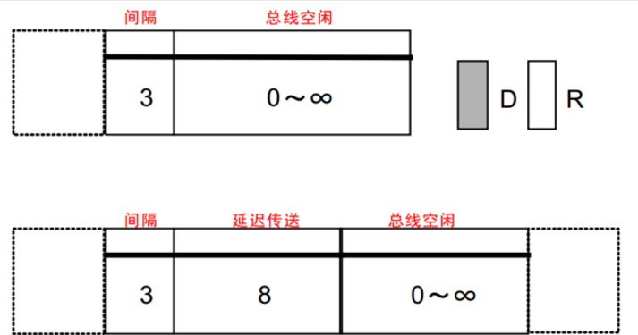
1. 连续发出的数据帧或遥控帧中间会有3位逻辑1的帧间隔
2. 帧间隔可以使接收设备有机会发送过载帧，发送设备需要重新等待总线空闲，从而实现了发送延迟
3. 帧间隔加上前面的EOF以及ACK界定符或者加上错误界定符或者过载界定符正好都是11位逻辑1，使总线进入空闲状态，其他设备就恰好可以开始发送
### 四、位填充
1. 位填充规则：发送方每发送5个相同电平后，自动追加一个相反电平的填充位，接收方检测到填充位时，会自动移除填充位，恢复原始数据
2. 例如
    |即将发送|实际发送|实际接收|移除填充|
    |:--|:--|:--|:--|
    |100000110|100000**1**110|1000001110|100000110|
    |10000011110|100000**1**1111**0**0|1000001111100|10000011110|
    |0111111111110|011111**0**11111**0**10|011111011111010|0111111111110|
3. 位填充作用：
    -防止波形长时间无变化，导致接收方不能对时间再同步
    -区分正常数据和错误帧和过载帧
    -防止误判总线空闲，连续11个逻辑1后设备判断总线空闲
### 五、采样时序
#### 1. 采样问题
1. 采样点一开始就没有对齐在数据中心，硬同步
2. 时钟误差累积导致采样点偏移位，再同步
#### 2. 位时序
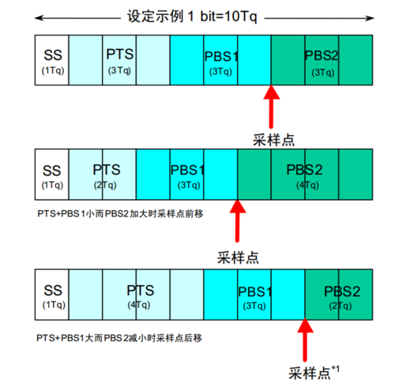
1. 一个数据位划分为多个最小时间单位Tq
2. SS(同步段)：1Tq，硬同步
3. PTS(传播时间段)：1~8Tq，等待电平稳定
4. PBS1(相位缓冲段1)：1~8Tq，确定采样位置
5. PBS2(相位缓冲段2)：2~8Tq，确定采样位置
#### 3. 硬同步
- 收到SOF的下降沿时(只在此位硬同步)，接收方会将自己的位时序计时周期拨到SS段的位置，与发送方的位时序计时周期保持同步
#### 4. 再同步
1. SJW(再同步补偿宽度值)：1~4Tq，这是最大宽度值，具体补偿会参考误差值
2. 再同步可以发生在第一个下降沿之后的每个数据位跳变边沿
3. 如果边沿发生在SS段后，说明接收方时钟快了，在这次位采样时依据SJW延长PBS1段，则下次SS段就会延迟，回到边沿
4. 如果边沿发生在SS段前，说明接收方时钟慢了，在这次位采样时依据SJW缩短PBS2段，则下次SS段就会提前，回到边沿
#### 5. 波特率
$$ 波特率=\frac{1}{一个数据位的时长} $$
### 六、仲裁
#### 1. 资源冲突问题
1. 在一个设备发送数据时有其他设备也想发送数据
2. 两个设备同时开始发送数据
#### 2. 先占先得
1. 总线有设备在发送数据帧或遥控帧，其他设备只能发送错误帧或过载帧。即同一时 刻只能有一个设备操作总线
2. 设备只有在连续检测到11个逻辑1时才会认为总线空闲，才能发送数据帧或遥控帧
#### 3. 非破坏性仲裁
1. 多个设备同时开始发送时会触发仲裁，ID号(仲裁段还包含RTR等)小的优先级高，能取得总线发送权，ID号大的进入接收状态
2. 实现原理
   -线与&：只要有一个设备发送逻辑0总线就呈现逻辑0，所以ID越小优先级越高
   -回读：设备发送一个位后会回读总线电平，以确认数据是否发出
3. 仲裁发生在仲裁段，当设备发现总线电平与自己发送的不同时就会自动释放总线转换为接收状态
4. 位填充不会影响仲裁
5. 仲裁有利的设备发送的数据不会受到任何影响，所以是非破坏性仲裁
6. 数据帧和遥控帧ID号一样时，数据帧的优先级高于遥控帧
7. 标准格式11位ID号和扩展格式29位ID号的高11位一样时，标准格式(遥控帧和数据帧)的优先级都高于扩展格式
### 七、错误处理
CAN协议没有错误处理也能正常工作，错误发生的原因往往来自信号干扰或者硬件损坏
#### 1. 错误类型
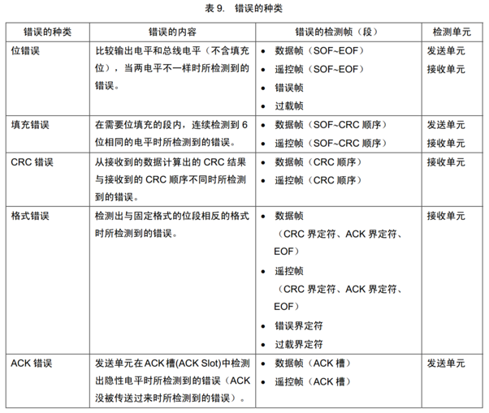
#### 2. 错误状态
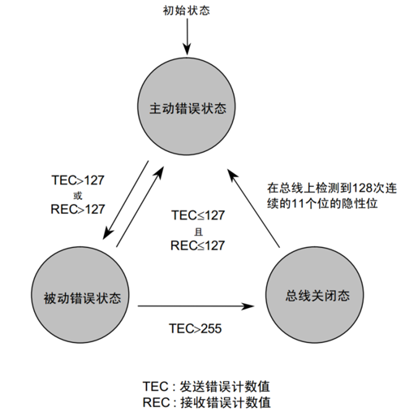
1. 主动错误状态：正常参与通信，检测到错误是发送主动错误帧
2. 被动错误状态：正常参与通信，检测到错误是发送被动错误帧，被动错误状态的设备还有8位延迟发送，即在一个完整帧后要延迟8位才能再次发送，这使得被动错误状态的设备在仲裁上天然失利于主动错误设备
3. 总线关闭态：不能参与通信
4. TEC：发送错误计数器，发送错误增加，正确发送减小
5. REC：接收错误计数器，接收错误增加，正确接收减小
#### 3. 错误计数器
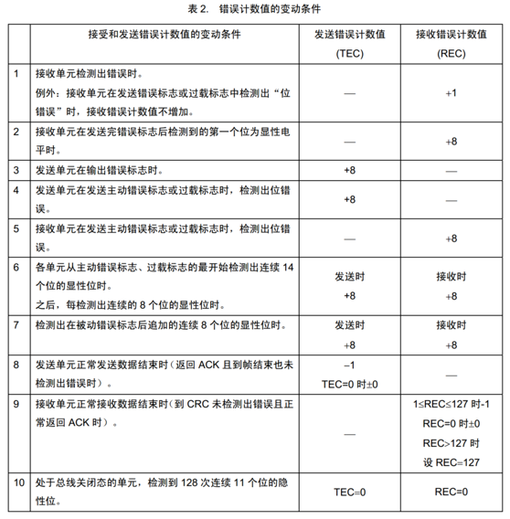
### 八、STM32G474的CAN外设介绍
#### 1.FDCAN简介
STM32G474支持CANFD(CAN with Flexible Data rate)可变数据速率的CAN
可以参考这篇文章：一文搞懂CAN和CAN FD总线协议https://blog.csdn.net/mengenqing/article/details/132583180
简单来说就是原来的CAN性能不够强，于是扩展CAN为CANFD，具体表现为两个方面
   - 一次可以发送的数据量从最大8字节提升到64
   - 数据场部分(还包含几个CANFD的位)的发送速率可以提高到8MHz，其他部分最多还是1MHz
   - 物理层完全兼容原来的CAN
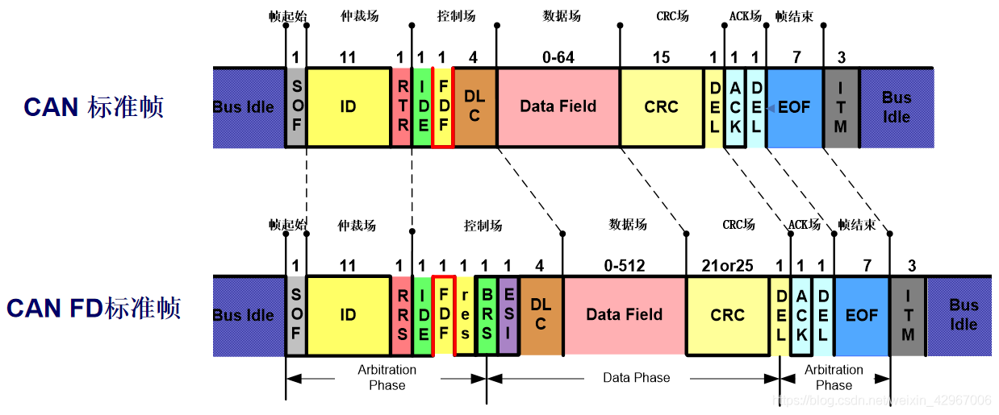
**下面的教程不使用CANFD模式，使用经典CAN**
#### 2.STM32G474CAN的几种工作模式
1. 普通模式，可以发送数据到总线也可以接收来自总线的数据
2. 监控模式，只能接收来自总线的数据，数据端口常为逻辑1
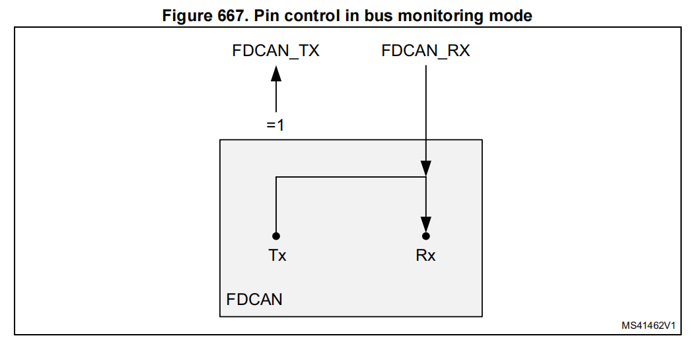
3. 回环模式，只接收来自自己的数据，外部回环可以把数据发送到总线
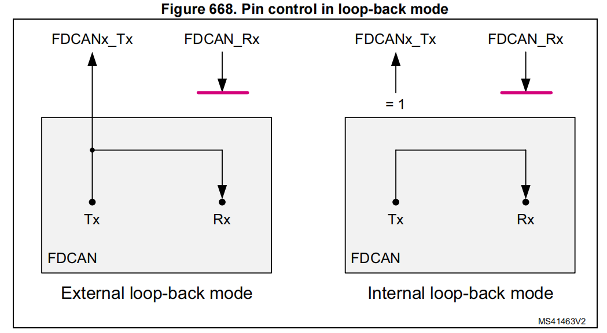
#### 3.STM32G474CAN的发送、接收和滤波器
##### 结构总览
下面分析STM32是怎么发送接收消息的，关于CAN的发送和接收的部分细节在G4的芯片手册写的不够直观，也可以参考一下F1的芯片手册
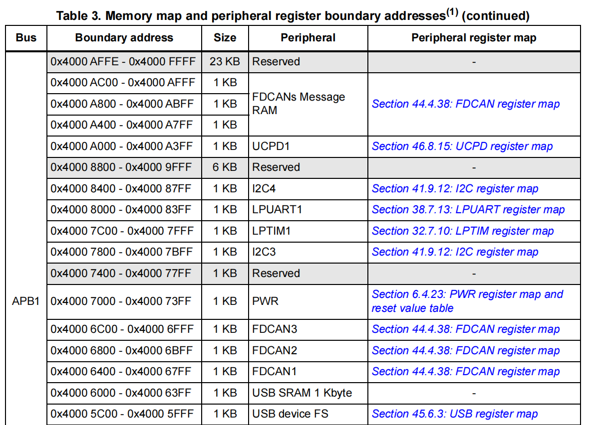
每个CAN都有一个消息RAM以及CAN的控制寄存器，上图说明了其具体地址，在CAN的使用中控制寄存器用于配置CAN的工作方式，滤波器、帧的发送和接收都在消息RAM中实现。stm32g474xx.h中名为FDCAN的结构体指针中只包含寄存器，在HAL库中的fdcan结构体的成员msgRam中才有消息RAM的详细操作位置。消息RAM的起始地址宏名为SRAMCAN_BASE
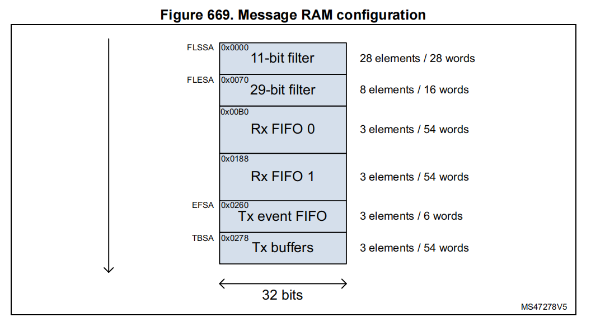
   - 每个CANFD有28个标准ID滤波器和8个拓展ID滤波器
   - 有两个接收FIFO，每个FIFO能存放三个数据
   - 一个发送事件FIFO，用于记录发送日志
   - 一个发送缓冲区，每个缓冲区能缓存三个数据
下面这张图片来自江协科技，更直观的描述了各个部分之间的关系
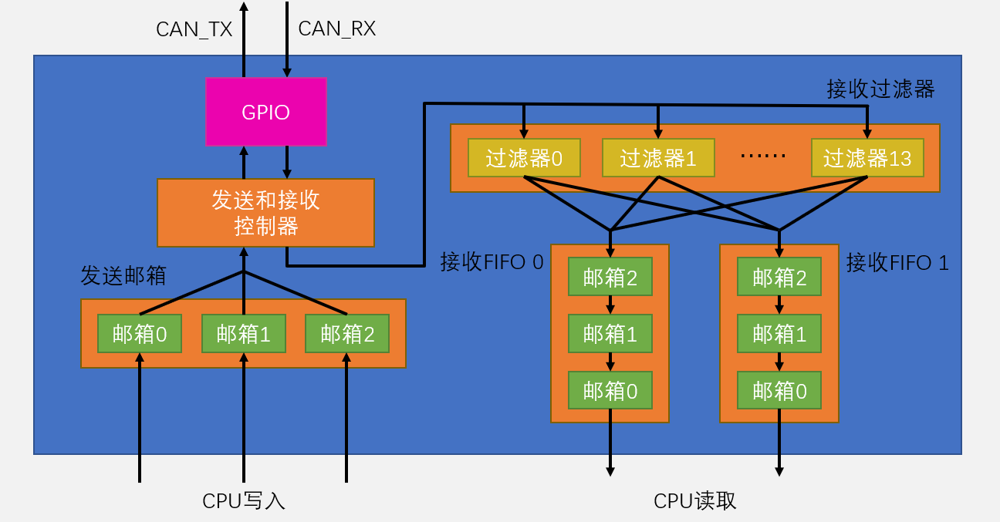
##### RxFIFO
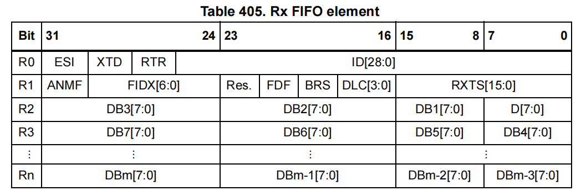
   - ESI：错误状态指示器，0为主动错误，1为被动错误
   - XTD：扩展标识符，0为标准ID，1为扩展ID
   - RTR：远程传输请求，0为数据帧，1为遥控帧
   - ID：标准ID存储在ID[28:18]
   - ANMF：接受的非匹配帧，0为该帧匹配过滤器，1为不匹配过滤器
   - FIDX：过滤器索引，表明帧通过的过滤器的索引、
   - Res.：保留
   - FDF：FD格式，0为普通CAN帧，1为FDCAN帧
   - BRS：比特率切换，0为未使用比特率切换，1为使用比特率切换
   - DLC：数据长度码，数据字节长度
   - RXTS：接收时间戳
   - DB：数据字节
##### TxBuffer
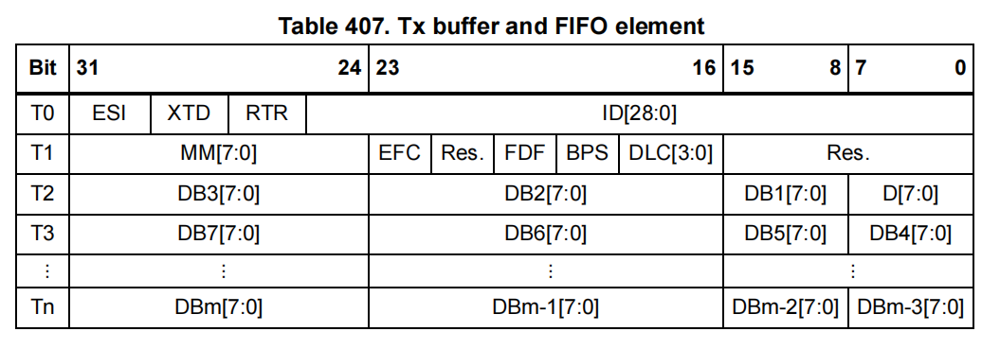
   - ESI：错误状态指示器，0为主动错误，1为被动错误
   - XTD：扩展标识符，0为标准ID，1为扩展ID
   - RTR：远程传输请求，0为数据帧，1为遥控帧
   - ID：标准ID存储在ID[28:18]
   - MM：消息标记，用于标注发送数据，启用发送事件时发送数据后会把Buffer前两个Word复制到发送事件FIFO，作用是用MM代表DB可以通过查询MM知道是哪个数据
   - EFC：事件 FIFO 控制，0为不存储发送事件，1为存储发送事件
   - Res.：保留
   - FDF：FD格式，0为普通CAN帧，1为FDCAN帧
   - BRS：比特率切换，0为未使用比特率切换，1为使用比特率切换
   - DLC：数据长度码，数据字节长度
   - DB：数据字节
##### Tx event FIFO
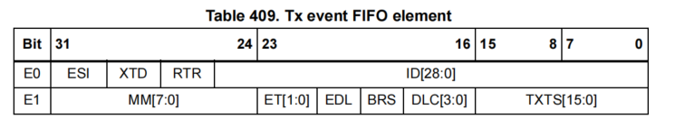
   - ET：事件类型，00为保留，01为发送完成，10为取消后仍发送，11为保留
   - EDL：扩展数据长度，0为标准帧格式，1为FDCAN帧格式
   - TXTS：发送时间戳
##### Standard ID filter
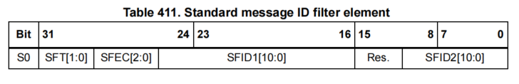
   - SFT：标准过滤器类型
     - 00：范围过滤（SFID1<=ID<=SFID2）
     - 01：双ID过滤（SFID1 或 SFID2）
     - 10：经典过滤（SFID1=ID，SFID2=掩码），掩码中1表示匹配位，0表示忽略位，不理解掩码过滤的可以看江协的教程
     - 11：禁用过滤器
   - SFEC：过滤器动作
     - 000：失能
     - 001：存入RxFIFO0
     - 010：存入RxFIFO1
     - 011：拒绝报文
     - 100：触发中断
     - 101：触发中断并存入FIFO0
     - 110：触发中断并存入FIFO1
     - 111：保留
   - SFID1：第一个标准ID
   - SFID2：第二个标准ID
##### Extended ID filter
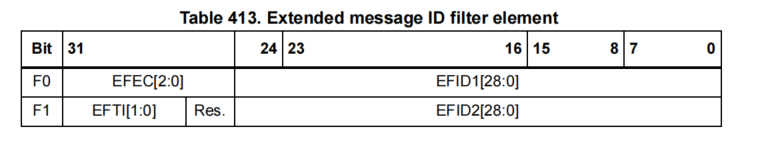
    - SFEC：过滤器动作，同上
    - EFID1：第一个扩展ID
    - EFT：11时为范围过滤并且忽略XIDAM mask，其他同SFT
    - EFID2：第二个扩展ID
##### FIFO模式与Queue模式
发送数据有两种模式：FIFO和Queue
   - 队列(Queue)模式下优先发送邮箱号小的数据
   - FIFO模式下优先发送最先写入的数据
##### 阻塞模式与覆盖模式
接收数据有两种模式：阻塞和覆盖
   - 阻塞模式下FIFO满时会抛弃新接收的数据
   - 覆盖模式下FIFO满时会覆盖最后接收的数据
##### 发送暂停与发送取消
   - 发送暂停模式下每次发送完后会等待总线空闲两位的时间才能启动下次发送，作用是防止高优先级的系统一直占用总线
   - 发送取消可以取消只适用于Queue模式，可以指定取消某一缓冲区的将要发送消息，或者取消这个消息的重发
#### 4.STM32G474CAN的位时序
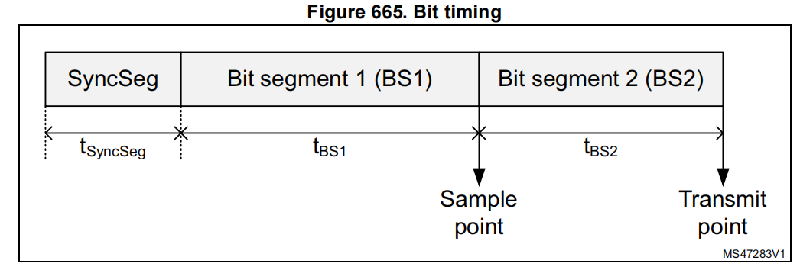
   - STM32的位时序中不包含PTS(传播时间段)
### 九、STM32CubeMX配置CAN
#### 1.环境介绍
本教程实现CubeMX上配置STM32G474的FDCAN作为普通CAN总线使用
#### 2.CubeMX参数详解
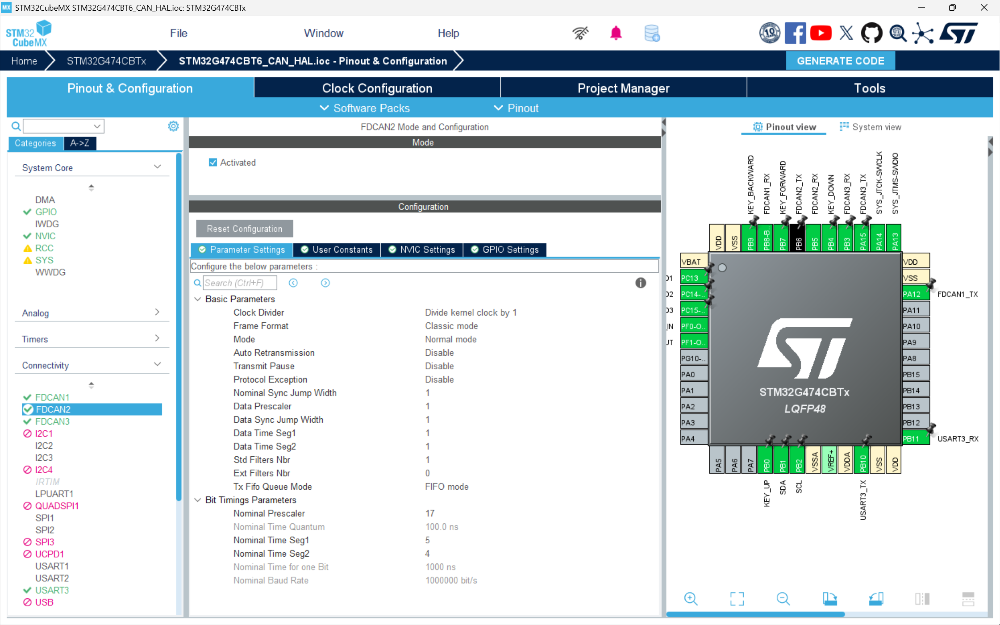
1. 把Activated勾上，这里有个问题是不要把CAN引脚配置在Boot0上，否则会不能正常启动单片机
2. Basic Parameters
   - Clock Divider：CAN输入时钟分频
   - Frame Format：是否使用发送速率切换，这是FDCAN的功能这里选择经典模式
   - Mode：CAN工作模式选择
     - 普通模式
     - 受限模式：部分功能不能使用
     - 总线监控模式：只接收不发送，只有接收端与外界连接
     - 内部回环模式：自己发送自己接收，不与外界连接
     - 外部回环模式：只接收自己发送的数据，只有发送端与外界连接
   - Auto Retransmission：自动重发
   - Transmit Pause：发送暂停
   - Protocol Exception：协议异常处理
   - Nominal Sync Jump Width：SJW(再同步补偿宽度值)的大小
   - Data Prescaler：数据速率分频，FDCAN使用
   - Data Sync Jump Width：数据段SJW(再同步补偿宽度值)的大小，FDCAN使用
   - Data Time Seg1：数据段PBS1(相位缓冲段1)，FDCAN使用
   - Data Time Seg2：数据段PBS2(相位缓冲段2)，FDCAN使用
   - Std Filters Nbr：标准ID滤波器数量，具体配置需要在代码中是实现
   - Ext Filters Nbr：拓展ID滤波器数量
   - Tx Fifo Queue Mode：发送使用Fifo或者Queue模式
3. Bit Timings Parameters
   - Nominal Prescaler：时钟预分频，决定最小时间Tq的大小
   - Nominal Time Quantum：Tq的大小
   - Nominal Time Seg1：PBS1(相位缓冲段1)
   - Nominal Time Seg2：PBS2(相位缓冲段2)
   - Nominal Time for one Bit：发送每字节的时间
   - Nominal Baud Rate：波特率
    $$ baud\ Rate=\frac{FDCAN\ Clock}{Clock\ Divider*Nominal\ Prescaler*(1+PBS1+PBS2)} $$
4. GPIO的配置不用修改
### 十、代码配置，启动，测试
**在不使用收发器连接其他CAN时要设置为回环模式**
下面的代码的CubeMX配置只在上面CubeMX配置的基础上改成了回环模式
``` C
//首先是滤波器和发送节点的配置
FDCAN_TxHeaderTypeDef TxHeader;
FDCAN_RxHeaderTypeDef RxHeader;

void FDCAN_Filter_Init(FDCAN_HandleTypeDef *hfdcan)
{
    FDCAN_FilterTypeDef sFilterConfig;
    
    sFilterConfig.IdType       = FDCAN_STANDARD_ID       ;  //目标为标准或拓展ID
    sFilterConfig.FilterIndex  = 0                       ;  //标准ID为0-27，拓展ID为0-7
    sFilterConfig.FilterType   = FDCAN_FILTER_DUAL       ;  //过滤模式
    sFilterConfig.FilterConfig = FDCAN_FILTER_TO_RXFIFO0 ;  //过滤器工作模式
    sFilterConfig.FilterID1    = 0                       ;  //标准ID范围为0-0x7FF(11)，拓展ID为0-0x1FFFFFFF(29)
    sFilterConfig.FilterID2    = 0                       ;  //
    
    HAL_FDCAN_ConfigFilter(hfdcan, &sFilterConfig);
    
    TxHeader.Identifier           = 0                  ;  //标准ID范围为0-0x7FF(11)，拓展ID为0-0x1FFFFFFF(29)
    TxHeader.IdType               = FDCAN_STANDARD_ID  ;
    TxHeader.TxFrameType          = FDCAN_DATA_FRAME   ;  //数据帧或者遥控帧
    TxHeader.DataLength           = FDCAN_DLC_BYTES_8   ;  //数据长度DLC
//    TxHeader.ErrorStateIndicator  = ;  //发送节点的错误状态，主动或被动
    TxHeader.BitRateSwitch        = FDCAN_BRS_OFF      ;  //FDCAN的波特率切换使能
    TxHeader.FDFormat             = FDCAN_CLASSIC_CAN  ;  //FDCAN模式使能
    TxHeader.TxEventFifoControl   = FDCAN_NO_TX_EVENTS ;  //是否存储发送事件
    TxHeader.MessageMarker        = 0                  ;  //消息事件表示
}

void FDCAN_Transmit(FDCAN_HandleTypeDef *hfdcan, const uint8_t *pdat)
{
    HAL_FDCAN_AddMessageToTxFifoQ(hfdcan, &TxHeader, pdat);
}

void FDCAN_Receive(FDCAN_HandleTypeDef *hfdcan, uint8_t *pdat)
{
    if (HAL_FDCAN_GetRxFifoFillLevel(hfdcan, FDCAN_RX_FIFO0))  //接收队列不为空
    {
        HAL_FDCAN_GetRxMessage(hfdcan, FDCAN_RX_FIFO0, &RxHeader, pdat);
    }
}

//使用演示
uint8_t ta[8] = {1,2,3,4,5,6,7,8};
uint8_t ra[8] = {0};
void main(void)
{
    HAL_Init();
    SystemClock_Config();
    MX_GPIO_Init();
    MX_FDCAN2_Init();
    //CAN
    FDCAN_Filter_Init(&hfdcan2);
    HAL_FDCAN_Start(&hfdcan2);  //必须调用FDCAN_Start，CAN才会工作
    FDCAN_Transmit(&hfdcan2, ta);  //数据发送出去后会进入CAN2的RxFIFO
    while(1)
    {
        FDCAN_Receive(&hfdcan2, ra);  //RxFIFO中的数据会被读到ra中
    }
}
```
**推荐的其他文章**
【经验分享】STM32G474 CANFD 用例详解https://shequ.stmicroelectronics.cn/thread-631870-1-1.html
FDCAN作为普通CAN使用(基于STM32G4)https://blog.csdn.net/NANA_FZM/article/details/131619321
【STM32 CAN】STM32G47x 单片机FDCAN作为普通CAN外设使用教程https://blog.csdn.net/qq_42820594/article/details/134381794